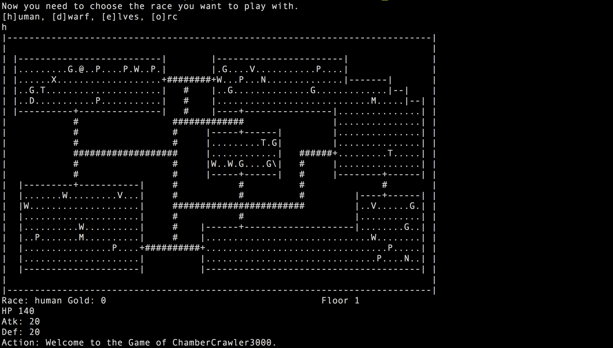

# The-Game-of-ChamberCrawler3000

In this project, I produced the video game ChamberCrawler3000 (CC3k), which is a simplifed rogue- like (a genre of video game based upon the game Rogue 1 - http://en.wikipedia.org/wiki/Rogue_(video_ game)).

A game of CC3k, consists of a board 79 columns wide and 30 rows high (5 rows are reserved for displaying information). Game play is as follows: The player character moves through a dungeon and slays enemies and collects treasure until reaching the end of the dungeon (where the end of the dungeon is the 5th foor). A dungeon consists of diferent foors which consist of chambers connected with passages. 

